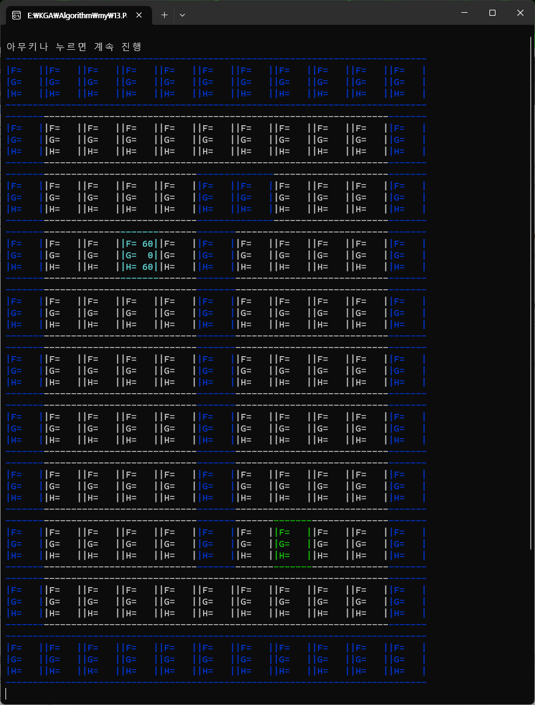
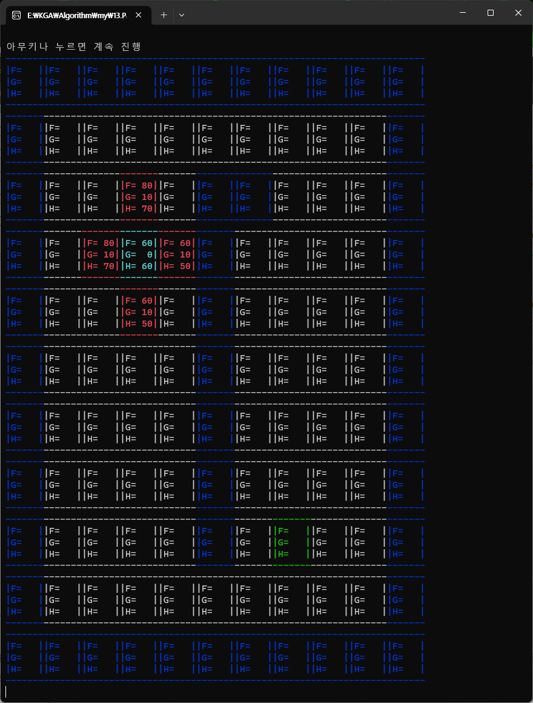
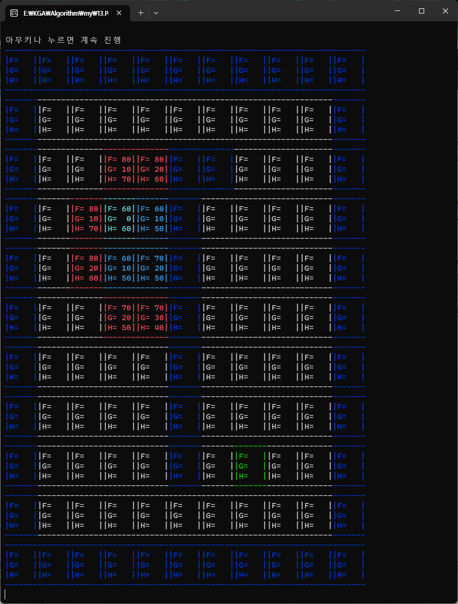
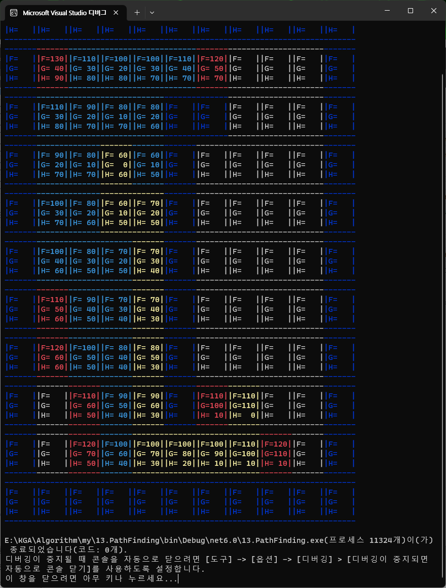

# A* Algoritm

## 기본 알고리즘

다익스트라 알고리즘을 확장하여 만든 최단경로 탐색알고리즘

경로 탐색의 우선순위를 두고 유망한 해부터 우선적으로 탐색

### 경로의 우선순위를 두는법 (경로 채점)

F = G+H

G - 시작점 으로 부터 현재 지정된 위치까지 걸리는 비용

H - 현재 위치 에서 부터 목적지 까지의 예상 비용

F - 현재 까지 이동에 걸린 비용 + 현재 위치부터 목적지까지의 예상 비용

**즉 F 값이 낮은거부터 탐색한다.**

> 자세한 설명은 코드에 있으니 확인

## 비주얼 라이징

해당코드는 아래의 링크를 따라가면있다.

[코드보기](#https://github.com/dMinsz/CSharp-DataStructure-Algorithm/blob/master/13.PathFinding/AStarVisualizer.cs)

시작시 시작지점과 목적지를 정해준다.

파란색은 벽을 의미하며 , 초록색이 목적지 , 하늘색이 시작지점이다

상하 좌우를 기준으로 탐색하게 만들었으며

각각의 우선순위를 체크하며 먼저 확인해야할 부분 부터 탐색을 시도한다.

두번정도 탐색을 더 시도한 결과이며

방문만 했던 곳과 이동해본 곳을 구별하기위해 진한 하늘색을 이용했다.

탐색이 완료되면 노란색으로 완성된 길을 보여준다.
