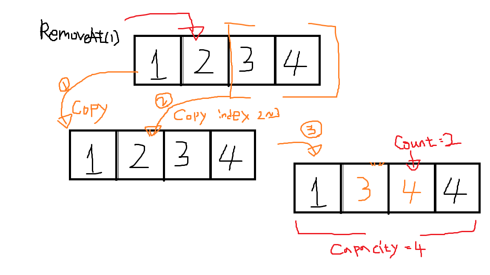
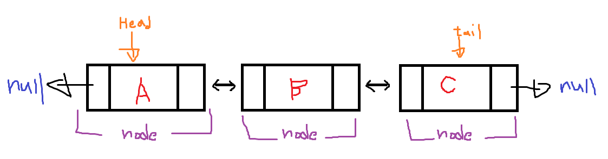

# 기술 면접 대비 정보 정리

## 배열과 선형 리스트

### 1. Array, List, LinkedList 차이는?


Array 는 선언할때 **크기** 와 **데이터 타입**을 지정해야한다.
List,LinkedList 는 데이터 타입만 지정해주면된다.

``` cs
//Array
int[] intArr = new int[10];
string[] stringArr = new string[5];

//List
List<int> intList = new List<int>();
List<string> stringList = new List<string>();

//LinkedList
LinkedList<string> linkedlist = new LinkedList<string>();

```

이와 같이

**Array** 는 메모리 공간에 할당할 사이즈를 미리 정해두고 사용하는 자료구조이다.
따라서 데이터 크기를 알 수 없거나, 사이즈가 변동 될 만한 상황에서는 사용하기에 부적합하다.

또한 중간에 데이터 삽입 및 삭제 할 때도 매우 비효율 적이다.

단 장점은 indexing 이 되어있어 값에 접근에 있어 편리한 장점이있다.

**List** 는 Array 와 달리 크기를 지정하지 않아도 된다는 장점이 있다.
즉 크기가 정해져 있지 않기 때문에 데이터의 크기 를 알 수 없거나 사이즈가 변동 되는 상황에
사용하기 에 적합하다.

단, Array 와 마찬가지로 데이터의 삽입 및 삭제 시에 새로운 배열을 만들고
각 요소들을 복사하여 저장하는 작업이 일어나기때문에 삽입,삭제를 자주 하는 작업에는
비효율적이다.

**LinkedList** 는 List 와 같은 사이즈를 미리 정해두지 않고 사용하는 자료구조이며,
레퍼런스 형으로 각 노드들이 연결되어 있어서 데이터의 삽입,삭제 시 Array, List 보다
더 효율적이다.

단, 데이터 검색 및 접근시 모든 노드들을 거쳐가면서 데이터를 탐색하기 때문에 Array, List
보다 더 비효율 적인 단점이있다.

## 선형 리스트 (C# => List, C/C++ => 동적배열)

### 2. 선형 리스트에 삭제 연산의 구현 방식에 대해 말해보세요



위의 그림처럼 하나의 인덱스 값에 접근하여 삭제를 요청할 경우

해당 자료구조를 똑같이 복사한후 기존의 구조에서 요청한 삭제 *인덱스 + 1* 이후 부터 마지막 요소까지
복사한 자료에 요청한 index 부터 마지막요소까지 복사하는 방식으로 삭제를 한다.

마지막값은 굳이 삭제시키지 않을 수도 있는데 그 이유는 전체 용량을 의미하는 Capacity 값과
현재 요소들의 갯수를 의미하는 Count 값으로 무시할수 있기 때문이다.

이러한 삭제연산은 보는것과 같이 비효율적인 연산을 한다.

#### 참고 : List의 시간복잡도

|접근 |탐색|삽입|삭제
|---|---|---|---|
|O(1)|O(n)|O(n)|O(n)|

## LinkedList

### 3. 연결리스트에 대해 설명해보세요

연결리스트는 연속적인 메모리 위치에 저장되지 **않는** 선형 데이터 구조이다.
노드 기반 데이터 구조이며 노드들간에 참조를 통해서 구현된다.


위의 예시는 이중연결 리스트의 구조를 만들어본것이다.

#### 장단점

장점
> 1. 동적 크기
> 2. 삽입, 삭제 의 용이

단점
> 1. 접근 하기 어려움 
> 2. 노드 기반 구조라 참조할때 사용할 데이터 공간이 더 필요하다.

#### LinkedList의 시간복잡도

|접근 |탐색|삽입|삭제
|---|---|---|---|
|O(n)|O(n)|O(1)|O(1)|


