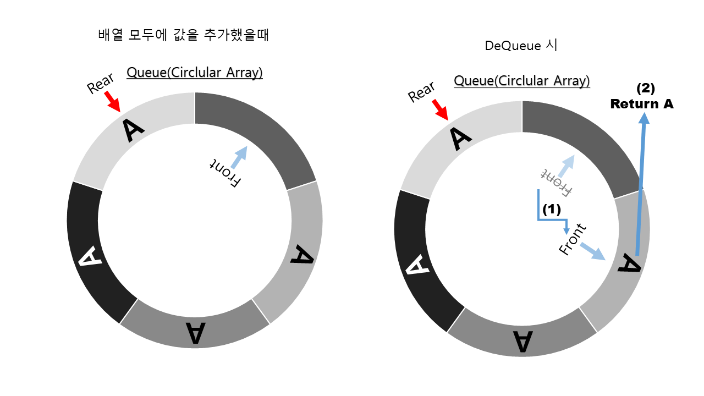

# Queue 구현 방법 및 설명

## 목차

[1. 기본 구조](#queue-의-기본-구조)

[2. 구현 방법](#구현-방법)

[3. 기본 데이터 세팅](#기본-데이터-세팅)

[4. Enqueue 구현](#enqueue-구현)

[5. IsFull 함수 구현 1](#배열의-공간이-다-찼는지-확인하는-방법)

[6. Dequeue 구현](#dequeue-구현)

[7. IsFull 함수 구현 2](#배열의-공간이-다-찼는지-확인하는-방법)

## Queue 의 기본 구조


**FIFO**(First in First OUT) 선입선출 LILO(후입후출) 방식의 자료구조

가장 먼저 입력된 데이터가 (가장먼저 온 데이터) 처리되어야하는 상황에 유용한 자료구조
순차적인 일에 대해서 사용한다.

예시: 대기열, 프린터 출력(대기열과 같음), 너비우선탐색(BFS) 알고리즘

## 구현 방법

여러가지 구현 방법이있겠지만 C#의 어댑터 패턴을 이용하여 LinekdList로 만드는게 
가장 쉬운 구현 방법이다.
[어댑터 패턴으로구현 한 내용은 여기서 보면된다.](https://github.com/dMinsz/CSharp-DataStructure-Algorithm/blob/master/4.StackAndQueue/Stack.cs)


그러나 삭제 작업시 인스턴스화 된 데이터를 GC가 처리하게되어 이부분이 매우 비효율적이다.

따라서 배열을 이용하여 구현하려고한다.

배열을 이용하여 구현하려면 원형 구조의 배열을 사용해야한다.


왼쪽의 그림을 코드로 설명하자면 아래와 같다.
## 기본 데이터 세팅
``` cs
//..중략
private const int DefaultCapacity = 4; //기본 크기설정
private T[] array;// 실제 데이터가 저장될 공간
private int front;// 첫 인덱스를 가리킴
private int tail;// 마지막 인덱스를 가리킴

//..중략

 public Queue()
{
    array = new T[DefaultCapacity + 1]; 
    // 첫값은 빈칸을 가리키고있어야하기때문에 + 1
    front = 0;
    tail = 0;
}
```

중요한점은 첫 번째 값을 빈칸으로 두어 Front와 rear를 비교하여
전체 배열이 다 찼는지 확인 을 할수 있다.

## Enqueue 구현
### (값 추가 함수)

 그림을 보면 값을 추가했을때 이인데 이를 코드로 적으면

``` cs
 public void Enqueue(T item)
        {
            if (IsFull())
            {
                Grow(); // 배열이 꽉찼으면 늘려준다.
            }

            array[tail] = item; // 값을 tail 위치에 넣어준다.
            MoveNext(ref tail); // 다음값으로 넘겨준다.
        }
//.. 중략
  private bool IsFull()
        {
            if (front > tail)
            {
                return front == tail + 1;
                // front 가 더 크면 한바퀴 돈거다.
                // 그상태에서는 front 와 tail 같으면 배열이 다찬것인데
                // 빈칸이 있기때문에 +1 해준것
            }
            else
            {
                return front == 0 && tail == array.Length - 1;
                //front 가 0 이면 첫값 && tail이 배열 끝에있다. => 다찬것
            }
        }
//.. 중략
private void MoveNext(ref int index)
        {
            index = (index == array.Length - 1) ? 0 : index + 1;
            // 인덱스가 마지막값을 가리키면 첫값으로(0) 으로 인덱스 변경
            // 아니면 +1 해주면된다.
        }
```

가 된다. Grow 함수는 구현하지않으면 지정된 크기에 원형 배열이되는 것이고
구현 하면 크기가 모자르면 자동으로 크기를 늘려주는 동적 배열이 된다.

``` cs
//Grow 함수 구현
private void Grow()
        {
            int newCapacity = array.Length * 2;
            T[] newArray = new T[newCapacity + 1];
            if (!IsEmpty())
            {
                if (front < tail)
                {
                    Array.Copy(array, front, newArray, 0, tail);
                    //front 가 tail 보다 작으면
                    //그대로 카피하면된다.
                }
                else
                {
                    Array.Copy(array, front, newArray, 0, array.Length - front);
                    Array.Copy(array, 0, newArray, array.Length - front, tail);

                    //front가 tail보다 크면
                    // 0 부터 array.Length - front 즉 한바퀴돌고 추가된 부분만 카피
                    // 한바퀴 돌기 전에 부분을 카피해준다. 
                    //array.Length - front 부터 tail 까지가 그부분을 의미한다.
                }
            }

            array = newArray;
            tail = Count;
            front = 0;
        }
```



## 배열의 공간이 다 찼는지 확인하는 방법
### (IsFull 함수 구현 1)

왼쪽 그림을 보면 배열에 값이 모두 차있을 때의 그림을 나타낸것이다.
즉 front < tail 일때 front 가 0이고 tail 이 array의 크기 -1 과 같다면
배열의 공간이 다 찬 것이다.

주의 할점은 만약 front가 한바퀴를 더 돌면 좀 달라지는 데 아래에서 더 설명을해서
IsFull 함수를 완성해보겠다.

```cs
  private bool IsFull()
        {
            //문제가있는 코드이다.
            //아래에서 제대로 더 구현하자.
            if(front < tail)
            {
                return front == 0 && tail == array.Length - 1;
                //front 가 0 이면 첫값 && tail이 배열 끝에있다. => 다찬것
            }
        }
```

## Dequeue 구현
#### (값삭제 함수)

오른쪽그림은 값을 빼는 작업 Dequeue 시에 그림을 보여주고있는데
값을 뺄때는 Front 값을 하나 이동시키고 거기에 있는 값을 리턴 해주면 된다.

```cs
public T Dequeue()
        {
            if (IsEmpty())
                throw new InvalidOperationException();

            T result = array[front];
            MoveNext(ref front); // 값을뺀후에는 이동시켜줘야한다.
            return result;
        }

//배열이 비었는지 확인하는 함수
  private bool IsEmpty()
        {
            return front == tail; // queue가 비워진것
        }
```


## 배열의 공간이 다 찼는지 확인하는 방법 2
#### (IsFull 함수 구현 2)


오른쪽 그림이 앞서 본 공간이 모두 찼을때 의 두번째 상황이다.
이걸 기준으로 코드를 완성해보자면

```cs
  private bool IsFull()
        {
            if (front > tail)
            {
                return front == tail + 1;
                // front 가 더 크면 한바퀴 돈거다.
                // 그상태에서는 front 와 tail 같으면 배열이 다찬것인데
                // 빈칸이 있기때문에 +1 해준것
            }
            else
            {
                return front == 0 && tail == array.Length - 1;
                //front 가 0 이면 첫값 && tail이 배열 끝에있다. => 다찬것
            }
        }

```
