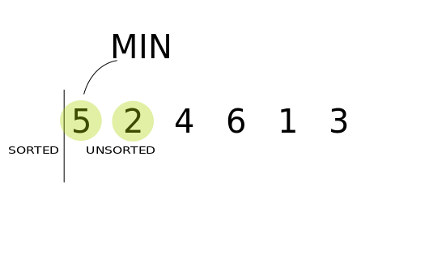

# 정렬

## 목차

>[1. 선형 정렬](#선형-정렬)
>>[1.1. 선택 정렬](#selection-sort)
>><br>[1.2. 삽입 정렬](#insertion-sort)
>><br>[1.3. 버블 정렬](#bubble-sort)

>[2. 분할정복 정렬](#분할정복-정렬)
>>[2.1. 힙 정렬](#heap-sort)
>><br>[2.2. 합병 정렬](#merge-sort)
>><br>[2.3. 퀵 정렬](#quick-sort)

### 정렬이란?

데이터의 집합을 어떠한 기준의 대소관계를 따져 일정한 순서로 줄지어 세우는 것이다.

## 선형 정렬

데이터의 비교에 의해서만 정렬하는 알고리즘

시간복잡도 : O(N^2)

### Selection Sort
*(선택정렬)*

정렬 방법 : 데이터 중 가장 작은 값부터 하나씩 선택하여 정렬

구현 방법 : 전체 데이터중 가장 작은 값을 선택하여 가장 앞에 두는 것을 반복하여 구현		   

> 1. 전체 배열을 접근하면서 가장 작은값구하기
> 2. 가장 작은 값을 가장 앞에 놓기
> 3. 가장 앞에 놓았으니 그것을 제외한 전체 배열을 재 탐색 그리고 1.2. 반복

<center></center>

```cs
    public static void SelectionSort(IList<int> list)
        {
            for (int i = 0; i < list.Count; i++)
            {
                int minIndex = i; // 가장 작은 값의 인덱스
                for (int j = i + 1; j < list.Count; j++)
                {  // j = i+1 인 이유는 이미 0번째 인덱스 값을 가장작은값으로 세팅해두어서
                    if (list[j] < list[minIndex]) // 현재 가장 작은 값보다 작은 값을 순회하면서 찾는다.
                    {
                        minIndex = j; // 현재 가장 작은값을 바꿔준다.
                    }
                }
                Swap(list, i, minIndex); // 전체 배열을 순회해서 가장 작은 값을 찾았으니 맨앞에 넣어준다.
            }
        }
```


### Insertion Sort
*(삽입 정렬)*

정렬 방법 : 데이터를 하나씩 꺼내어 정렬된 자료 중 적합한 위치에 삽입하여 정렬한다.

구현 방법 :  

>1. 두 번째 자료부터 시작하여 
>2. 그 앞(왼쪽)의 자료들과 비교하여 삽입할 위치를 지정
>3. 삽입할 위치에 자료를 뒤로 옮기고 지정한 자리에 자료를 삽입하여 정렬

즉, 두 번째 자료는 첫 번째 자료, 세 번째 자료는 두 번째와 첫 번째 자료, 네 번째 자료는 세 번째, 두 번째, 첫 번째 자료와 비교한 후 자료가 삽입될 위치를 찾는다.

자료가 삽입될 위치를 찾았다면 그 위치에 자료를 삽입하기 위해 자료를 한 칸씩 뒤로 이동시킨다.

 
<center></center>


 ```cs
        public static void InsertionSort(IList<int> list)
        {
            for (int i = 1; i < list.Count; i++) // 배열의 두번째 자리부터 시작
            {
                int select = list[i]; // 현재 선택된 데이터
                int j; 
                for (j = i-1; j >=0 && select < list[j]; j--) // 선택된 데이터의 앞의 자료들 모두 비교하여
                {                                           // 선택된 데이터의 위치를 찾아낸다.
                    list[j + 1] = list[j];// 위치를 찾았으면 원래값을 한칸 뒤로 미룬 위치로 이동
                }
                list[j + 1] = select; // 선택된 위치에 데이터 삽입
            }
        }
 ```

 ### Bubble Sort
*(거품 정렬)*

정렬 방법 : 서로 인접한 데이터를 비교하여 정렬

구현 방법 :  

>1. 첫 데이터를 선택한다
>2. 선택한 데이터의 그 다음 데이터 와 비교후 필요시 순서를 바꿔준다.
>3. 모든 배열의 요소와 2.번을 반복한다.
>4. 모든 배열의 요소와 비교가 끝났으면 그 다음 데이터를 선택하고 2.3.을 배열크기만큼 반복해준다.


<center></center>


버블 정렬은 첫 번째 자료와 두 번째 자료를, 두 번째 자료와 세 번째 자료를, 

세 번째와 네 번째를, … 이런 식으로 (마지막-1)번째 자료와 마지막 자료를 

비교하여 교환하면서 자료를 정렬한다.


```cs
 public static void BubbleSort(IList<int> list)
        {
            for (int i = 0; i < list.Count; i++)
            {
                for (int j = 1; j < list.Count; j++)
                {
                    if (list[j - 1] > list[j]) // 서로 인접한 데이터 비교
                        Swap(list, j - 1, j); // 필요시 데이터 스왑
                }
            }
        }
```


## 분할정복 정렬

1개의 요소를 재위치시키기 위해 전체의 **1/2**를 확인하는 정렬

n개의 요소를 재위치시키기 위해 **n/2**개를 확인하는 정렬

:fire: 시간복잡도 : O(NlogN)


### Heap Sort
*(힙 정렬)*
정렬 방법 : 힙을 이용하여 우선순위가 가장 높은 요소부터 가져와 정렬

구현 방법 : 우선순위큐를 이용하여 넣고 빼면 자동으로 정렬이된다.


<center></center>


```cs
        public static void HeapSort(IList<int> list) 
        {
            PriorityQueue<int, int> heap = new PriorityQueue<int, int>();

            for (int i = 0; i < list.Count; i++)
            {
                heap.Enqueue(list[i], list[i]);
            }

            for (int i = 0; i < list.Count; i++)
            {
                list[i] = heap.Dequeue();
            }

        }
```

**주의점**

이상적인 경우에 시간복잡도가 O(NlogN)이 나오긴 하지만

:warning: 실제 시간을 측정하면 **다른 분할정복 정렬들 보다 느리다**

그 이유는 선형적인 데이터는 CPU 의 캐시에 데이터가 올라가서 
반복작업하는게 빠르지만

heap은 힙 구조상 데이터를 뛰엄뛰엄 탐색하기때문에 일반적인 배열을 탐색할때보다 속도가 느리다.

:fire: **안정성이 떨어진다.** (4 5(1) 5(2) 9 일때 같은숫자인 5 의 위치가 깨질수도있다.)


### Merge Sort
*(합병 정렬)*

정렬 방법 : 데이터를 2분할하여 정렬 후 합병을 반복

구현 방법 : 

>1. 리스트의 길이가 0 또는 1이면 이미 정렬된 것으로 본다. 
>2. 그렇지 않은 경우에는 정렬되지 않은 리스트를 절반으로 잘라 비슷한 크기의 두 부분 리스트로 나눈다.
>3. 각 부분 리스트를 재귀적으로 합병 정렬을 이용해 정렬한다.
>4. 두 부분 리스트를 다시 하나의 정렬된 리스트로 합병한다.


<center></center>


```cs
        public static void MergeSort(IList<int> list, int left, int right)
        {
            if (left == right) return;

            int mid = (left + right) / 2;   // 반으로 분할할 위치 계산
            MergeSort(list, left, mid);     // 분할된 왼쪽 부분 정렬
            MergeSort(list, mid + 1, right);// 분할된 오른쪽 부분 정렬
            Merge(list, left, mid, right);  // 정렬된 2개의 부분 배열 병합
        }

        public static void Merge(IList<int> list, int left, int mid, int right)
        {
            List<int> sortedList = new List<int>();
            int leftIndex = left;
            int rightIndex = mid + 1;

            // 분할 정렬된 List를 병합
            while (leftIndex <= mid && rightIndex <= right)
            {
                if (list[leftIndex] < list[rightIndex])
                    sortedList.Add(list[leftIndex++]);
                else
                    sortedList.Add(list[rightIndex++]);
            }

            if (leftIndex > mid)    // 왼쪽 List가 먼저 소진 됐을 경우
            {
                for (int i = rightIndex; i <= right; i++)
                    sortedList.Add(list[i]);
            }
            else  // 오른쪽 List가 먼저 소진 됐을 경우
            {
                for (int i = leftIndex; i <= mid; i++)
                    sortedList.Add(list[i]);
            }

            // 정렬된 sortedList를 list로 재복사
            for (int i = left; i <= right; i++)
            {
                list[i] = sortedList[i - left];
            }
        }
```

**주의점**

:warning: 분할 하면서 메모리 공간을 추가로 사용하기 때문에 메모리가 부족하다면 불리하다.
 
:warning: 안정성이 좋다 (4 5(1) 5(2) 9 일때 같은숫자인 5 의 위치가 안깨진다.)


### Quick Sort
*(퀵 정렬)*

정렬 방법 : 하나의 피벗을 지정하여 피벗을 기준으로 2분할 하여 정렬

구현 방법 : 

> 1. 하나의 피벗을 정한다 (보통 배열의 맨앞, 맨뒤 요소로 지정)
> 2. 피벗을 맨앞에 요소로 정했다면 그다음 요소인 두번째 요소(leftIndex)와 마지막요소(RightIndex)를 변수로만들어준다.
> 3. leftIndex 와 rightIndex가 서로의 데이터를 비교하여 데이터를 교환한다.
> 4. 데이터 교환, 혹은 교환하지않았는 지 확인후 leftIndex 는 한칸 오른쪽으로 rightIndex 는 한칸 왼쪽으로 이동한다. 
> 5. 만약 leftIndex,rightIndex가 교차가 된다면 피벗이 정렬된 위치에 가게된것이라 판단하고 피벗을 다음 위치에 요소로 바꿔준다.
> 6. 위의 내용을 반복하며 모든 배열의 요소가 한번씩 다 피벗이 되었으면 종료


<center></center>


```cs
        public static void QuickSort(IList<int> list, int start, int end)
        {
            if (start >= end) return;

            int pivotIndex = start;
            int leftIndex = pivotIndex + 1;
            int rightIndex = end;

            while (leftIndex <= rightIndex) // 엇갈릴때까지 반복
            {
                // pivot보다 큰 값을 만날때까지
                while (list[leftIndex] <= list[pivotIndex] && leftIndex < end)
                    leftIndex++;
                while (list[rightIndex] >= list[pivotIndex] && rightIndex > start)
                    rightIndex--;

                if (leftIndex < rightIndex)     // 엇갈리지 않았다면
                    Swap(list, leftIndex, rightIndex);
                else    // 엇갈렸다면
                    Swap(list, pivotIndex, rightIndex);
            }

            QuickSort(list, start, rightIndex - 1);
            QuickSort(list, rightIndex + 1, end);
        }
```

**주의점**

추가적인 메모리를 잡지않기 때문에 메모리적 부담은 적다.

:warning: 단 최악의 경우에 정렬시간이 오래걸릴수있다. (정렬이 거꾸로되어있을때가 최악이다.)

최악의 경우 시간복잡도가 O(N^2)이 되어 선형 정렬과 다를게 없어진다.

